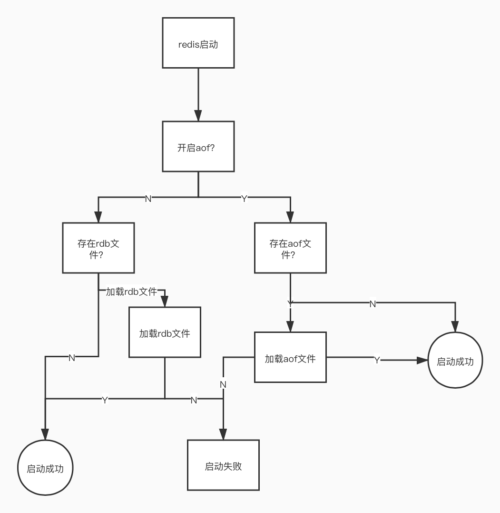
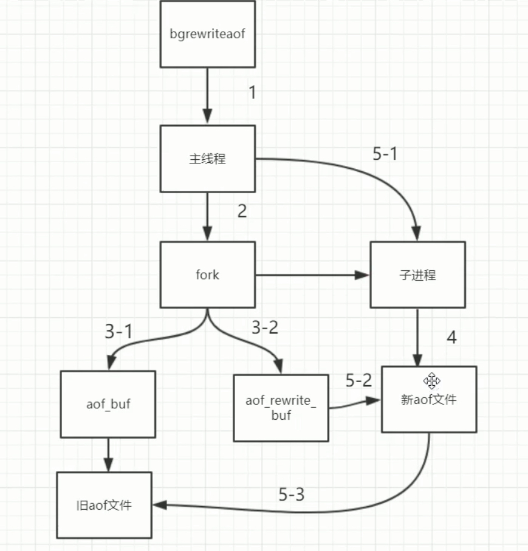
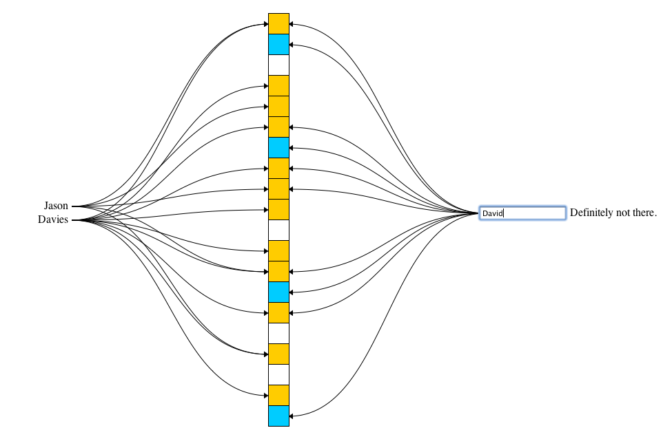

# Redis

单线程（不会有并发问题），高性能的（key/value）内存数据库，基于内存运行并且支持持久化

## 安装

1. 解压
2. make
如果make报错的话 可能需要安装gcc 然后执行make distsclean 来删除之前build的缓存
3. make install

查看redis默认安装位置
/usr/local/bin

## 常用命令行工具

redis-benchmark 性能测试  
redis-check-aof 修复aof持久化文件  
redis-check-rdb 修复rdb持久化文件  
redis-cli 客户端工具  
redis-sentinel 启动哨兵节点  
redis-server  启动服务端  

redis 在启动的时候会在dir下找rdb文件去回复数据

## api操作[https://redisdoc.com/](https://redisdoc.com/)

## redis的持久化机制

### RDB 

适合大数据到导入，性能好，但是会丢失数据

#### 是什么？

原理是redis会单独创建（fork）一个与当前进程一摸一样的子进程来进行持久化，这个子进程的所有数据（变量。环境变量，程序计数器等）都和原进程一摸一样，会先将数据写入到一个临时文件中，呆持久化结束了，再用这个临时文件替换上次持久化好都文件，整个过程中，主进程不进行任何的io操作，这就确保了极高的性能。（因为如果用主线程的话，其他IO操作会阻塞比如读写数据）

#### 什么时候触发rdb持久化？

- shutdown时，如果没有开启aof，会触发
- 执行命令save或者bgsave会触发。
    - save只管保存，其他不管，全部阻塞  
    - bgsave redis会在后台异步进行快照操作同时可以响应客户的请求
- 执行flushall命令  是清空所有的数据 （因为如果不做持久化那么如果意外当机，flushall就失效了）
- 配置文件中默认的快照配置 （如果要关闭就删除这个配置）
```
save 900 1
save 300 10
save 60 10000
```
如果有主从复制的情况rdb关不了，因为他就是利用rdb来实现主从复制

### AOF 

解决数据丢失的问题，但是性能差，不适合大量数据导入

#### 是什么？

原理是将Redis的操作日志以追加的方式写入文件，读操作是不记录的，整体分为三步  

数据写入内存 --> 数据写入aof_buf --> 写入持久化文件。第二步到第三步什么时候执行根据配置文件触发机制  

**<font color=red>注意： aof持久化不会fork子进程</font>**

#### 为什么要AOF？

因为rdb是定时操作所以会导致数据丢失（比如在下一次持久化之前当机了）

#### 如何开启

```
appendonly yes
```

#### 触发机制

```
appendfsync everysec
```

- no: 表示等操作系统进行数据缓存同步到磁盘（快、持久化没保证）等buffer区域满了才会触发没保证 绝对不能用
- always: 同步持久化，每次发生数据变更时，立即记录到磁盘（慢，安全）
- everysec: 表示没秒同步一次（默认值，很快，但是可能会丢失一秒内到数据）这个用得比较多

#### 启动流程



**如果aof和rdb不一致。由于启动了aof就不会加载rbd来所以启动要先关闭aof，然后使用 config set appendonly yes来启动aof。然后再去该配置**

#### AOF文件格式

命令： SELECT 0
```
*2    //代表有几组命令
$6    //命令长度
SELECT
$1
0
```

#### AOF 重写

##### 什么是重写

去除AOF冗余数据，减少aof文件的大小

##### 触发机制
当AOF文件增长到一定大小到时候redis能够调用bgrewriteaof对日志文件进行重写。当AOF文件大小当增长率大于该配置项时自动开启重写（这里指超过愿大小当100%）（第一次触发之后） 

auto-aof-rewrite-percentage 100

当AOF文件增长到一定大小到时候redis能够调用bgrewriteaof对日志文件进行重写。当AOF文件大小大于该配置项时自动开启重写（第一次触发）

优化到话就调整这个参数，因为重写会消耗性能，所以不是很大到情况下就不需要重写

auto-aof-rewrite-min-size 64mb

**<font color="red">注意：重写操作是通过fork子进程来完成到，所有正常到aof不会fork子进程，触发来重写才会</font>**



##### 命令

bgrewriteaof

#### redis 4.0 之后混合持久化机制
AOF重写前以rdb格式，重写之后用AOF格式
```
aof-use-rdb-preamble yes
```

## redis数据类型

### string

string类型是二进制安全的。意思是redis的string可以包含任何数据。比如jpg图片或者序列化的对象。

string类型是Redis最基本的数据类型，<font color="red">**一个redis中字符串value最多可以是512M**</font>

### list

它是一个字符串链表，left、right都可以插入添加； 如果键不存在，创建新的链表； 如果键已存在，新增内容； 如果值全移除，对应的键也就消失了。 链表的操作无论是头和尾效率都极高，但假如是对中间元素进行操作，效率就很惨淡了。

### set

Redis的Set是string类型的<font color="red">**无序**</font>，不能重复的集合。

### hash

Redis hash 是一个键值对集合。 Redis hash是一个string类型的field和value的映射表，hash特别适合用于存储对象。

kv模式不变，但v是一个键值对

类似Java里面的Map<String,Object>

### zset 

有score来排序

Redis zset 和 set 一样也是string类型元素的集合,且不允许重复的成员。 不同的是每个元素都会关联一个double类型的分数。 redis正是通过分数来为集合中的成员进行从小到大的排序。zset的成员是唯一的,但分数(score)却可以重复。

## redis内容扩展

### GEO

经纬度距离运算

### hyperLogLog

用来做基数统计的算法。可以计算有多少个不同值，只要把IP地址加进去就可以计算网站的访问量

### bitmaps

位图，可以直接对内部二进制操作， 可以用来扩容 ```setbit key 10000 0```

bitcount 来统计数组中有多少个1

可以实现不保存数据库的情况下点赞功能

## 缓存几大问题

### 缓存穿透

查询了一个不存在的数据

数据库没有，缓存也没有，这个适合不应该去查数据库

#### 方案

- 缓存空对象

    当没有在数据库查到数据库加一个空对象在redis缓存 

    - 缺点：
        - 如果黑客使用不同的key来攻击会导致redis有大量的空对象 
        - 超过过期事件后还是会去访问数据库

- 布隆过滤器： 实现原理是将值用n种hash算法来标记，最后来判断是否n个位置都为1

    布隆过滤器是一个集合里面有一亿个值，看key是否在集合中，占用内存特别小，底层使用位图实现

    有误判率（因为hash碰撞） 误判率（数组大小和hash函数的个数）越高消耗的内存越小

    

    - 实现方法

        - Google 的 Guava 包里面有 BloomFilter 
            
            缺点：但是分布式不能用，创建的空间是占用java内存的

        - 可以用redis来实现

            1. 定义容错率和预计大小，

            2. 通过算法来创建多少大小的位和多少个hash函数

            3. 计算出hash值与数组大小取余
            
            4. 利用bitmap的方法去存redis

    - 缺点：
        - 维护麻烦，如果往数据库添加数据时需要添加到布隆过滤器中。 
        - 布隆过滤器 <font color="red">**不能删除**</font>。需要定时替换新的不布隆滤器

### 缓存雪崩

大部分数据失效
- 原因

    - 机器故障

    - 设置过期时间 --> 同时失效

- 解决方案

    - 高可用集群

    - 错开过期时间

## [redis集群](redis集群.md)

