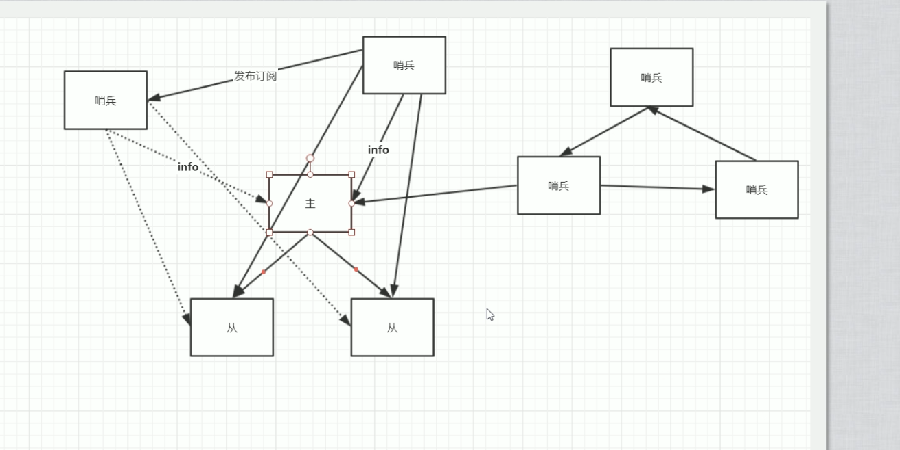

# redis 主从复制

## 开启

- 手动

    重启就失效

    - 添加主机

        ```bash
        slave of host:port
        ```

    - 删除主机

        ```bash
        slave of no one
        ```

    - 查看身份信息

        ```bash
        info replication
        ```

- 配置文件

    - ``replicaof <masterip> <masterport>``

    - ``masterauth <master-password>``

## 实现原理

1. 建立连接

2. 数据同步（全量复制）

3. 命令传播（增量复制）

# redis 哨兵 

另外的节点

- 配置文件

    sentinel.conf

    sentinel monitor <mastername> <masterhost> <masterport> <至少结果哨兵人为挂了才触发故障切换>

    sentinel auth-pass

