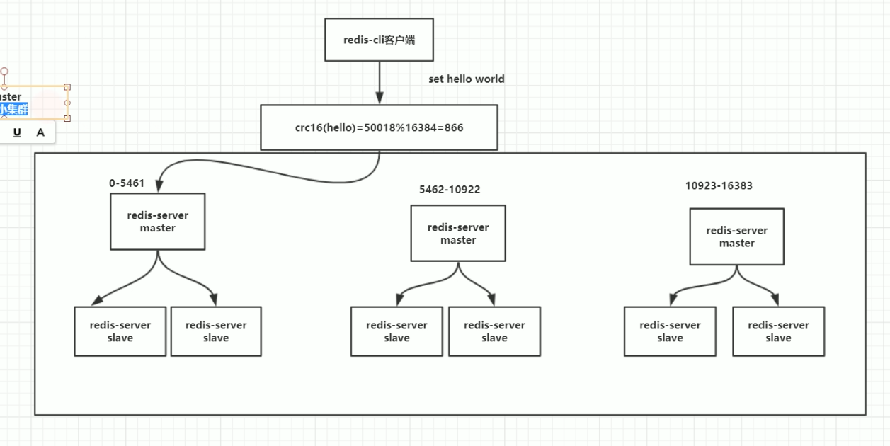

# redis 集群

## 集群演变过程

1. 单机版

    核心技术：持久化

    缺点：

    - 没有高可用redis挂了就没了。
    
    - 读写能力受限。吞吐量有限制

    - qps瓶颈

2. 主从复制

    扩大了读写能力。实现了故障备份。复制是高可用Redis的基础，哨兵和集群都是在复制的基础上实现高可用的

    缺点：
    
    - 没有高可用，需要人为把从机变成主机

3. 哨兵

    在复制的基础上，实现了自动化的故障恢复。加入了主从切换自动化

    缺点：

    - 写操作无法负载均衡，写的节点还是主机

    - 存储能力收到单机的限制

    - 故障转移期间（主从切换）是不可用的

4. 集群

    通过集群，Redis解决了写操作无法负载均衡，以及存储能力受到单机限制的问题，实现了较为完善的高可用方案

## redis 集群的实现
 


对16384取余是redis规定的

最少有3组小集群，官方规定

## 如何开启

1. 修改配置文件

    1. 设置bind/端口

    2. 设置dir/log/pid文件 目录

    3. 设置主masterauth从requirepass密码

    以防主从切换，这里无论是主从节点都配置一下

    4. cluster-enabled yes

        必须要分配槽位

    5. cluster-config-file 地址

        保存其他机器的信息地址

    6. cluster-require-full-coverage yes

        如果主机在没有从节点时主机挂了，能不能正常工作。可以保证数据一致性但是可用性会收到影响

2.  启动多个redis实例

3. 分配主从，分配槽位

    - 手动

        1. meet
        
            要让所有的集群通信

            ```bash
            cluster meet ip port
            ```

        2. 指派槽位

            ```bash
            cluster addslots slot
            ```
        
        3. 指定主从

            ```bash
            cluster replicate node-id
            ```

    - 一条命令搞定

        - 老版本

            ```bash
            redis-trib.rb --cluster help
            ```

        - 新版本

            ```bash
            redis-cli --cluster help
            redis-cli --cluster create xxx.xxx.xxx.xxx（所有的连接地址） --cluster-replicas 2（主从的比例，1:2前面的是主机，后面的是从机；默认平均分配槽位）
            add-node/del-node
            ```

## 如何连接

```bash
redis-cli -h xxx.xxx.xxx.xxx -c(以集群方式连接)
```

## 扩容，增加节点

1. 添加node

    ```bash
    redis-cli --cluster add-node new_host:new_port existing_host:existing_port --cluster-slave(以从节点方式加入) --cluster-master-id(主节点nodeid)
    ```

2. 分配槽位

    ```bash
    redis-cli --cluster reshard host:port(已存在的)
    ```

## 缩容，删除节点

1. 重写分配槽位

    ```bash
    redis-cli --cluster reshard --cluster-from 迁出nodeid --cluster-to 迁入nodeid --cluster-slots 迁移的数量
    ```

2. 删除node
    
    ```bash
    redis-cli --cluster del-node  host:port(已存在的) node_id
    ```

**tips: 先删除从节点，因为如果删除主节点会触发主从切换，没有必要**